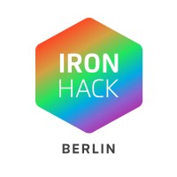

# Ironhack Final Project

### Machine learning models comparison 

#### 1 Brain Storming and Data Preparation: 

In the early stages of this course I realised what it is that I would be liking the most, and so I decided to focus myself mostly in that area; this area is the **coding** part, meaning building an infrastructure for people to have better use of their **data**. Visualization it is of course important but it wasn't my sole focus. 

The idea for this project was born when I discovered a python library called **Streamlit** back in December 2020, streamlit works as a layer that goes on top of your code to make it interactive. It was then when I decided that I wanted to create some sort of Data process / visualization app for my final project. 

The original idea was to create a app that takes any given **CSV** or **Excel** file, and depending on the parameters provided is how users would have been able to interact with the data. This turned out to be extremely complicated, since every **Data Set** is different. I had to tailor my script to one specific **CSV file**, and the outcome is what you are able to find here

The dataset used for this project was taken out of the following URL:

https://www.kaggle.com/sakshigoyal7/credit-card-customers

Analysis will be very simple, basic ETL, cleaning, standardize the data, split the training sets, fit them into 5 different models, and compare the scores. 

#### 2 Exploratory Analysis: 

There's two parts of visualization inside this app: 

**1)** The basic one- in which you can select to compare specific features against each other, straight out of the DF 

**2)** After transformation- this falls into further analysis, after standarization of the data. Here the user wil, be able to find trends and perform a visual analysis (**ex. pairplot**) to come to their own conclusions. 

#### 3 Data Analysis & Model training: 

As mentioned in the beginning, we will be fitting out data into 5 different ML models to compare their scores, these are:

**a)** Logistic Regression

**b)** Support Vector Machine

**c)** Decision Tree

**d)** MLP Classifier

**e)** Random Forest Classifier

#### 4 The app: 

Because the app is self interactive, the story telling happens at the same time you are interacting with the app. I learned a lot of Streamlit which I believe it is a super fun way to make your data interactive and have other users interact with your data, not only show. 

This library offers a wide range of options, and even showed me a bit of HTML, among other things like building a defensive code. There are still many things to improve like **cache** and my app not running **everything** everytime a parameter is changed during the interaction; this consumes a lot of memory and time, and I it could definitely be faster.

Please feel free to add thing to my code, I would love to make it better and keep learning from other people. 

